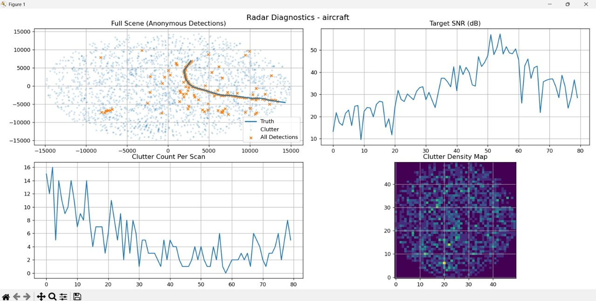
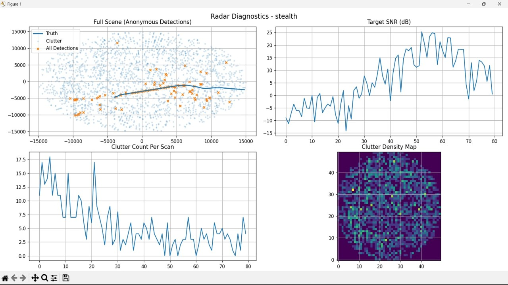
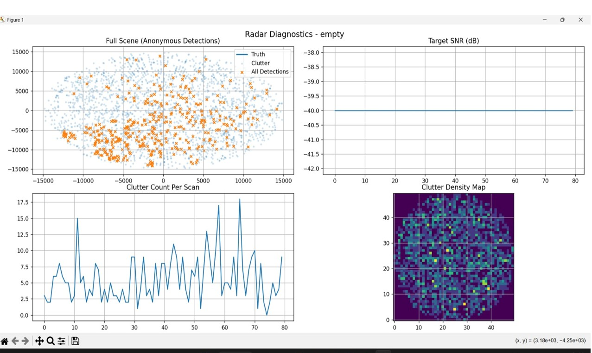
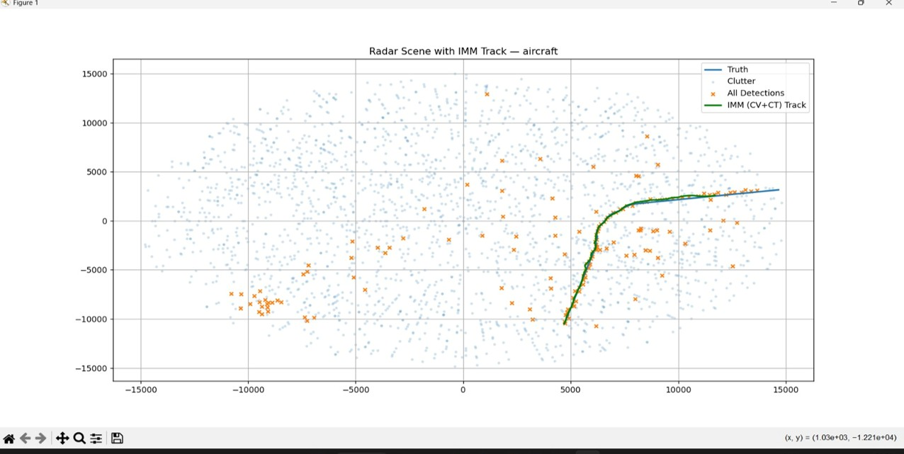
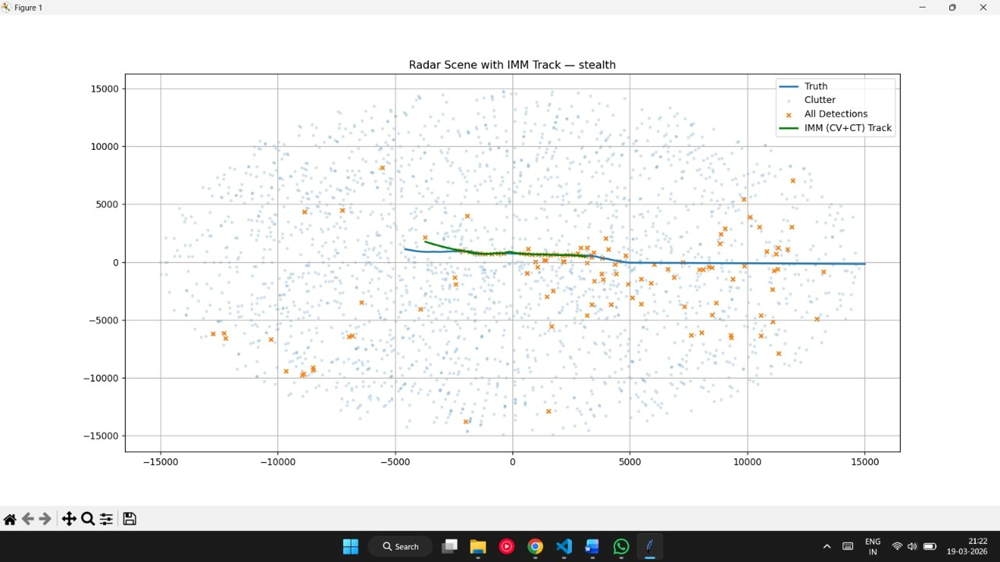
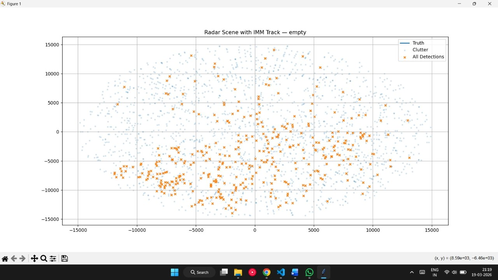
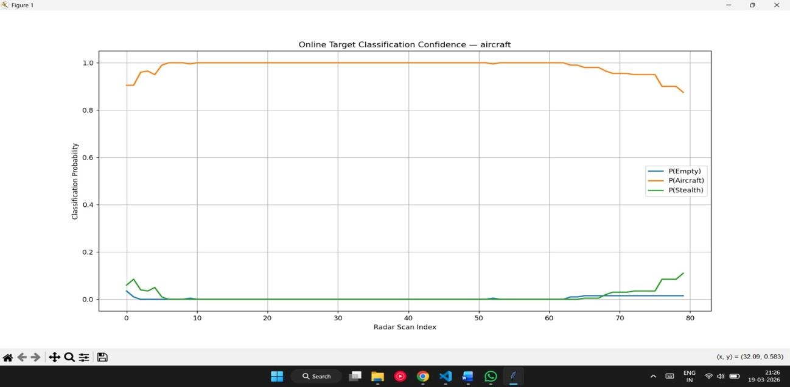
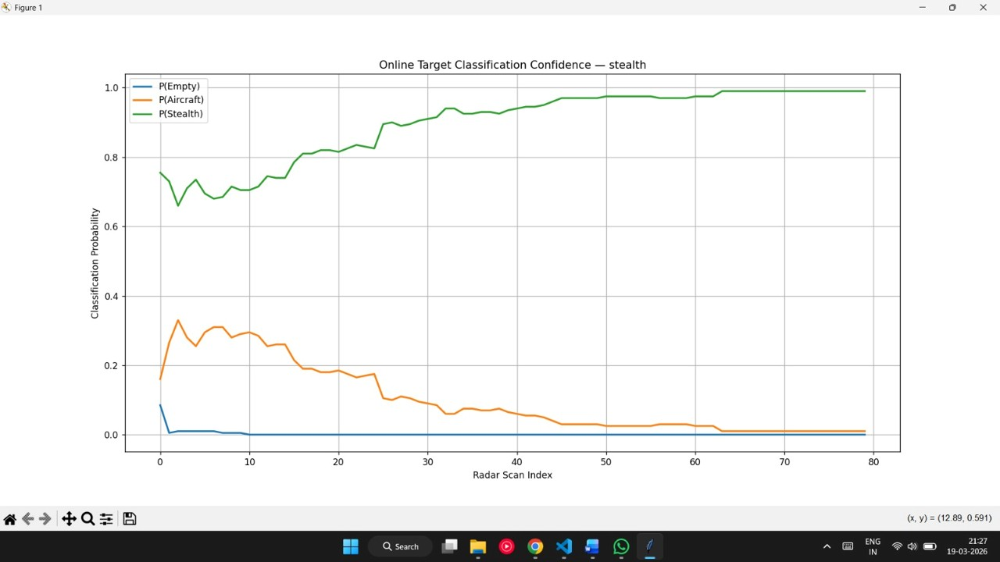
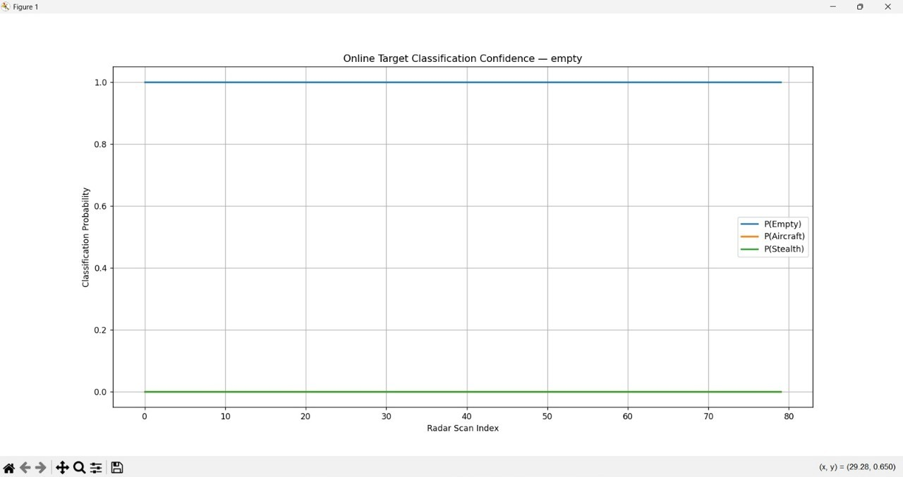

# ML-Based Classification of Low Radar Cross-Section Aerial Targets

A physics-based radar simulation and machine learning pipeline for classification of low Radar Cross Section (RCS) aerial targets such as stealth aircraft under noisy and cluttered radar environments.

The project combines:
- Radar signal simulation
- Clutter and noise modeling
- CFAR-based detection
- IMM-EKF-PDA tracking
- Feature extraction
- XGBoost classification

---

# Problem Statement

## Stealth Aircraft Detection

Stealth aircraft are designed to have very low Radar Cross Section (RCS), making them difficult to detect using conventional radar systems.

At large distances:
- Radar returns from stealth aircraft become extremely weak
- Signal-to-Noise Ratio (SNR) falls near or below the radar noise floor
- Reliable detection becomes difficult or impossible

At smaller distances:
- The aircraft becomes detectable
- However, its RCS is still much smaller than a normal fighter aircraft
- This makes classification and tracking unreliable

Instead of relying only on direct radar visibility, this project attempts to learn hidden behavioral patterns from radar returns and tracker dynamics.

Even if precise localization is not possible, the system can still provide an early warning that a stealth target may have entered the airspace.

This allows defense systems to deploy higher capability assets such as:
- AWACS
- Airborne surveillance systems
- Long-range tracking platforms

for further tracking and engagement.

---

# Project Objective

Multi-class classification problem:
- Stealth Aircraft
- Conventional Aircraft
- No Target Present

The idea is to:
1. Simulate realistic radar environments
2. Simulate IMM-PDA-EKF based Tracker
3. Extract behavioral features from radar and tracking data
4. Train an ML model to classify the target type

---

# System Pipeline

## 1. Radar Simulation Pipeline

```text
Motion Model
      ↓
Radar Equation + RCS
      ↓
Power Map, Range-Bearing Grid
      → Receiver Noise Floor
      ↓
Clutter + Noise Model
      → Stochastic Receiver Noise
      → Patch Clutter
      → Point Clutter
      ↓
CFAR Detector
      ↓
Radar Measurements
      → Range Measurement Noise
      → Bearing Measurement Noise
      ↓
Tracking
      ↓
Feature Extraction
      ↓
XGBoost Classifier
```

---

# Radar Simulation

## Motion Model
The project simulates target motion using:
- Constant Velocity motion
- Constant Turn motion
- Maneuvering trajectories

Different maneuver patterns are generated for:
- Aircraft
- Stealth aircraft
- Clutter objects

---

## Radar Equation + RCS

The radar environment is generated using:
- Physics-based radar equation
- Radar Cross Section (RCS) modeling
- Range-based signal attenuation

Stealth targets are modeled with significantly lower RCS values compared to normal aircraft.

---

## Range-Bearing Grid and Power Map

The radar space is divided into:
- Range bins
- Bearing bins

Each radar cell stores received signal power.

The generated power map represents how radar energy appears across the radar field.

---

# Clutter and Noise Modeling

The simulation includes realistic radar clutter.

## Types of Clutter

### Stochastic Receiver Noise
Random receiver noise caused by thermal and electronic fluctuations.

### Patch Clutter
Large-area reflections from:
- Terrain
- Buildings
- Vegetation
- Sea surface
- Weather

### Point Clutter
Localized clutter from:
- Birds
- Debris
- Small reflective objects

---

# Detection Pipeline

## CFAR Detector

The project uses:
### OS-CFAR (Ordered Statistic Constant False Alarm Rate)

Purpose:
- Detect targets under varying clutter conditions
- Maintain stable false alarm rate
- Improve robustness under noisy environments

---

## Radar Measurements

Detected targets are converted into:
- Range measurements
- Bearing measurements

Measurement uncertainty is added to simulate realistic radar errors.

---

## Radar Simulation Outputs

<p align="center">
  
  
  
</p>

---

# Tracking System

## IMM-EKF-PDA Tracking Pipeline

```text
Radar Detections
      ↓
Adaptive Measurement Noise
      ↓
Track Initialization
      ↓
IMM Interaction
      ↓
Prediction (CV & CT)
      ↓
Gating
      ↓
PDA Association
      ↓
EKF Update
      ↓
IMM Probability Mode Update
      ↓
State Fusion
      ↓
Final Track
```

The tracking system combines:
- IMM (Interacting Multiple Model)
- EKF (Extended Kalman Filter)
- PDA (Probabilistic Data Association)

---

# Tracking Components

## Adaptive Measurement Noise

Measurement uncertainty dynamically changes according to SNR.

Low SNR:
- Higher uncertainty
- Tracker trusts prediction more

High SNR:
- Lower uncertainty
- Tracker trusts radar measurements more

---

## IMM Tracking

The IMM tracker combines:
- Constant Velocity (CV) model
- Constant Turn (CT) model

This allows tracking of:
- Straight motion
- Maneuvering targets

The tracker dynamically adjusts model probabilities based on target behavior.

---

## Gating

The project uses:
### Mahalanobis Distance Gating

Purpose:
- Reject unlikely detections
- Reduce clutter associations
- Handle uncertainty-aware validation

---

## PDA Association

Probabilistic Data Association (PDA) is used to:
- Associate detections probabilistically
- Handle cluttered radar environments
- Improve tracking robustness

---

## EKF Update

The Extended Kalman Filter:
- Predicts target motion
- Updates target state using radar measurements
- Updates covariance uncertainty

---

## Tracking Outputs

<p align="center">
  
  
  
</p>

---

# Feature Extraction & Classification

```text
From Tracking System
        ↓
Feature Extraction
        ↓
XGBoost Classifier
        ↓
Target Classification
```

## Feature Extraction

Behavioral and tracking-based features are extracted from:
- Radar detections
- SNR behavior
- IMM probabilities
- Covariance evolution
- Detection consistency
- Motion statistics
- Tracker stability

A total of 28 features are extracted.

### Extracted Features

```python
FEATURE_NAMES = [

    # Signal Quality (SNR Behavior)
    "mean_snr",
    "snr_variance",
    "snr_trend",

    # Detection Pattern Features
    "total_detections",
    "detections_per_scan_std",
    "max_detections_in_scan",
    "longest_detection_gap",
    "detection_presence_ratio",
    "detection_burst_count",

    # Motion / Kinematic Features
    "centroid_motion_speed",
    "centroid_motion_variance",

    # Track Lifecycle & Stability
    "track_initialized",
    "time_to_track_initialization",
    "track_length",
    "covariance_trace_mean",
    "covariance_trace_growth",
    "covariance_trace_std",

    # IMM Model Behavior
    "mean_CV_probability",
    "mean_CT_probability",
    "mode_switch_count",
    "mode_probability_variance",

    # Gating & Association Features
    "gated_detections_mean",
    "tracker_miss_ratio",
    "innovation_magnitude_mean",
    "detections_inside_gate_ratio",
    "snr_dropout_ratio",
    "track_velocity_variance"
]
```

---

## XGBoost Classification

The extracted features are passed into an:
### XGBoost Multi-Class Classifier

Classifier output:
- Aircraft
- Stealth
- Empty Airspace

The model learns hidden relationships between:
- Radar signal behavior
- Detection consistency
- Tracker dynamics
- Motion characteristics

---

# Dataset Generation

The project generates:
- Aircraft scenes
- Stealth scenes
- Empty airspace scenes

Features and labels are stored in compressed `.npz` datasets.

Labels:
- Aircraft → 0
- Stealth → 1
- Empty → 2

---

# Evaluation Metrics

## Performance

- ~92% classification accuracy at 0.85 confidence threshold

## Classification Report

```text
Strict Classification Report (P >= 0.85)

              precision    recall    f1-score    support

Aircraft          0.87       0.99       0.92      10640
Stealth           0.98       0.90       0.94      12320
Empty             0.91       0.87       0.89      13040

accuracy                                0.92      36000
```

## Metrics Used
- Accuracy
- Precision
- Recall
- F1-score
- Confusion Matrix

---

## Classification Outputs

<p>
  
  
  
</p>

---

# Tech Stack

- Python
- NumPy
- Stone Soup
- XGBoost
- Scikit-learn
- Pandas
- Matplotlib

---

# Repository Structure

```text
├── simulation.py
├── tracking.py
├── feature_extraction.py
├── dataset.py
├── train_model.py
├── result.py
├── merge_tempfile.py
├── read_dataset.py
└── results/
```

---

# Future Improvements

- Multi-radar sensor fusion
- Multi-target tracking
- Real radar IQ data integration
- Transformer/LSTM temporal models
- Electronic warfare modeling
- Passive radar systems

---

# Research Domains

This project combines concepts from:
- Radar Signal Processing
- Tracking and State Estimation
- Control Systems
- Sensor Fusion
- Statistical Detection Theory
- Aerospace Surveillance
- Machine Learning

---

# Disclaimer

This project is a research and educational simulation intended for learning purposes in:
- radar tracking
- probabilistic estimation
- ML-based signal interpretation

It is not connected to any real military radar system or classified defense technology.
